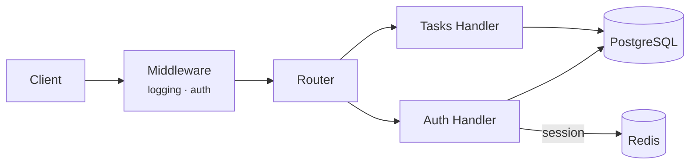

# Task Manager

A per-user task tracking API written in Go, backed by PostgreSQL and Redis.
Authentication is session-based rather than token-based: sessions are
server-side state, so logout is a real revocation, not just a discarded
cookie.

## System Design



Every request passes through a logging layer and an authentication layer.
The auth layer resolves the `session_id` cookie against Redis, injects the
user ID into the request context, and lets the two handler groups remain
unaware of how identity was established.

## API

| Method | Path          | Auth | Description                        |
|--------|---------------|:----:|-------------------------------------|
| POST   | `/register`   |  –   | Create an account                  |
| POST   | `/login`      |  –   | Authenticate, open a session       |
| POST   | `/logout`     |  ✓   | Revoke the current session         |
| GET    | `/tasks`      |  ✓   | List tasks (filter / sort / limit) |
| POST   | `/tasks`      |  ✓   | Create a task                      |
| GET    | `/tasks/{id}` |  ✓   | Fetch a task                       |
| PATCH  | `/tasks/{id}` |  ✓   | Partially update a task            |
| DELETE | `/tasks/{id}` |  ✓   | Remove a task                      |
| GET    | `/health`     |  –   | Liveness probe                     |

`GET /tasks` accepts `completed`, `category`, `due`, `priority`, `search`,
`sort`, and `limit` as query parameters, composed into one parameterized
query at request time.

## Data Model

| `users`           |               | `tasks`            |                              |
|--------------------|---------------|---------------------|------------------------------|
| `id`               | serial, PK    | `id`                | uuid, PK                     |
| `email`            | unique        | `user_id`           | FK → `users.id`, cascade     |
| `hashed_password`  |               | `title`             | unique per user               |
| `created_at`       |               | `priority`          | `low` \| `medium` \| `high`  |
| `updated_at`       |               | `due_date`, `category`, `completed` | |

## Security Notes

- Passwords are hashed with bcrypt; plaintext never reaches storage.
- Sessions live in Redis with a sliding one-hour expiration, renewed once
  fewer than fifteen minutes remain.
- Session cookies are `HttpOnly`, `Secure`, `SameSite=Lax`.
- Every task query is scoped by `user_id` at the SQL layer — there is no
  code path that reads another account's data.
- A failed login against a non-existent email is delayed by one second,
  to keep the timing signal close to a wrong-password response.

## Running Locally

```bash
docker compose up --build
```

Requires a `.env` with `ADDR`, `PG_HOST`, `PG_USER`, `PG_PASSWORD`,
`DB_NAME`, `REDIS_HOST`, `REDIS_DB`, `REDIS_PROTOCOL`, `LOG_LEVEL`
(`REDIS_PASSWORD` and `LOG_PATH` are optional).

## Stack

| Layer       | Choice                                   |
|-------------|-------------------------------------------|
| Language    | Go 1.24                                    |
| HTTP        | `net/http` — stdlib method+path routing    |
| Database    | PostgreSQL 17, raw SQL via `lib/pq`        |
| Sessions    | Redis 8.2                                  |
| Auth        | bcrypt + server-side sessions              |
| Logging     | `log/slog`                                 |
| Deployment  | Docker Compose                             |
